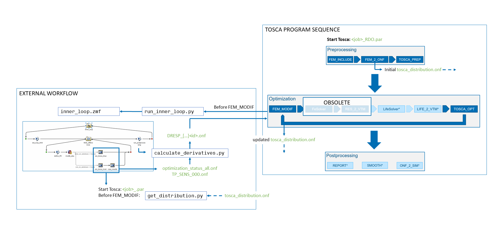

Introduction
============
This code presents a framework for performing robust design optimization (RDO) using the FE solver *Abaqus* by `SIMULIA <https://www.3ds.com/products/simulia>`_ and the corresponding optimization software *Tosca Structure*. The framework applies a Taylor series-based approach for estimating mean and standard deviation of design responses (DRESPs) where finite differences are used to calculate sensitivites with respect to random variables (RVs). Development started in March 2020 during an internship at Dassault Systèmes and continued throughout the following master's thesis at the `Institute for structural mechanics in lightweight design (SML) <https://www.tuhh.de/sml/en/home>`_ from Hamburg University of Technology (TUHH) in collaboration with Dassault Systèmes. The underlying theory and numerical examples have been published in [1]_ and [2]_. See `/docs/userguide.rst <./docs/userguide.rst>`_ for a detailed description on how to setup the RDO.

The code is intended for academical purposes. It is not developed actively but depending on research activities may be updated in the future. This repository is a cleaned-up version of the development-repository to provide a leaner and better-documented code-base for publication.

Overview
========
The given framework extends the functionality of SIMULIA's optimizer Tosca Structure by substituting an external workflow for the solver call. The Tosca program sequence is shown in Fig. 1 with the external workflow branching off before the module ``FEM_MODIF``. The external workflow calculates the modified DRESPs as a superposition of mean value and weighted standard deviation and saves the DRESP values and sensitivities to ``.onf``-files to be used by the optimization module ``TOSCA_OPT``. As there is currently no option to disable the default solver call, the solver will be launched anyways after completion of the external workflow, although the results are not being used.

   `Fig. 1`  Program sequence of RDO workflow showing TOSCA modules and external workflow as flow process diagram.

For every iteration of the optimization/outer loop, a `User Script Entry Point (or "hook") <https://help.3ds.com/2024/english/DSSIMULIA_Established/TsoCmdMap/tso-r-cmd-driver-hooks.htm?contextscope=all&id=c6294ae54333436db0365608f0432db2>`_ is used to launch the main script ``run_inner_loop.py`` for the external workflow/inner loop. From there, a job-specific Isight model ``inner_loop.zmf`` is launched. This model applies finite difference steps to the RVs that are included in the Abaqus simulation model and distributes files from the outer loop to the subdirectories for the inner loop. The individual analyses for the finite differences are carried out using a Tosca optimization having 0 iterations. After that, the model calls ``calculate_derivatives.py`` for calculating the modified DRESP and sensitivities based on the result files from the inner loop. The modified DREPs are written to ``.onf``-files and placed in the working directory of the optimization to be used by the optimization module in the outer loop.

Software requirements
=====================
The workflow does not function as a standalone software framework but must be used in combination with SIMULIA Abaqus, Tosca and Isight. Valid licenses must be obtained by the user and are **NOT** part of this code basis. 

* SIMULIA Abaqus
* SIMULIA Tosca Structure
* SIMULIA Isight

Development started using version 2021 of the aforementioned products but the code was tested up until version 2024. As Abaqus and Tosca are shipped with a Python interpreter, no additional Python environment is required and the code relies exclusively on the Python interpreters included. At the time of development, Abaqus used Python 2.7, which is why especially ``calculate_derivatives.py`` may feature outdated syntax. The code has been tested under Windows 10, 11 and Ubuntu 22.04.4 LTS.

Future plans
============

If time permits to continue development of the code-basis, the next thing to be implemented should be **tests**. As I did not know about proper testing when starting the implentation, test have been performed based on example models and debug output. However, especially the mathematical programming lends itself to unit tests for each of the functions in order to ensure quality.

References
==========

.. [1] \K. Steltner, B. Kriegesmann, and C. B. W. Pedersen, “Robust sizing optimization of stiffened panels subject to geometric imperfections using fully nonlinear postbuckling analyses,” Thin-Walled Structures, 175, 109195, Jun. 2022, doi: `10.1016/j.tws.2022.109195 <https://doi.org/10.1016/j.tws.2022.109195>`_.

.. [2] \K. Steltner, C. B. W. Pedersen, and B. Kriegesmann, “Semi-intrusive approach for stiffness and strength topology optimization under uncertainty,” Optimization and Engineering, Sep. 2022, doi: `10.1007/s11081-022-09770-z <https://doi.org/10.1007/s11081-022-09770-z>`_.
